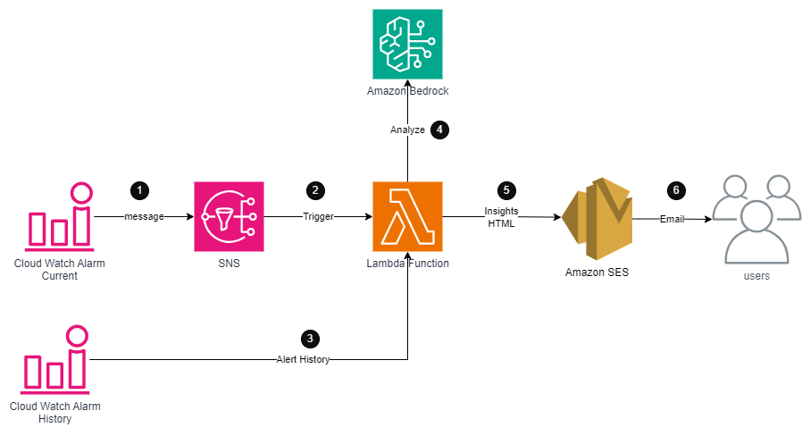
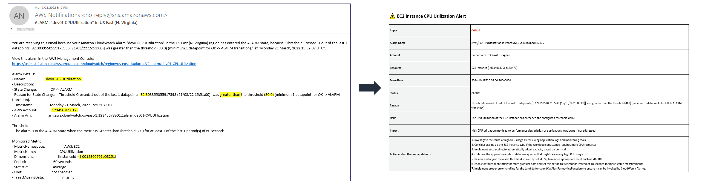

# Generate GenAI Based Insights from Amazon CloudWatch alarms for email notifications using Amazon Bedrock

This solution enables you to enhance Amazon CloudWatch alarm email alerts using Amazon Bedrock and Anthropic Gen AI Models. It extracts relevant information from alarm messages, analyzes historical data, and provides AI-generated insights and recommendations in an easy-to-read HTML format.

# Architecture



The diagram shows the following workflow:

1. Amazon CloudWatch alarm state changes and sends a notification alert to the associated SNS topic.
2. Amazon SNS invokes the subscribed Lambda function.
3. The Lambda function retrieves the last 5 CloudWatch alarms for additional context.
4. Lambda calls Amazon Bedrock to analyze the current alarm and historical data using the Anthropic Haiku model.
5. Lambda function parses the alarm message, incorporates AI-generated insights, and calls the Amazon SES API.
6. Amazon SES applies the HTML formatting based on a specified template and sends the formatted email with actionable insights.

# Prerequisites

1. AWS account & IAM User or Role 
2. [AWS CLI v2](https://docs.aws.amazon.com/cli/latest/userguide/getting-started-install.html) installed
3. A verified [Amazon SES identity](https://docs.aws.amazon.com/ses/latest/dg/verify-addresses-and-domains.html) for the sender email
4. Access to Amazon Bedrock and the Anthropic Haiku model

# Deployment
1. Clone the **genai-based-cloud-watch-alerts-insights** github repository to your computer using the following command:
    ```
    git clone https://github.com/aws-samples/genai-based-cloud-watch-alerts-insights
    ```

2. Configure the [AWS credential keys](https://docs.aws.amazon.com/cli/latest/userguide/cli-configure-quickstart.html) to authenticate and authorize the AWS CLI commands on your account.

3. Verify an email identity in Amazon SES. This is the email address that you will use as sender:
    ```
    aws ses verify-email-identity --email-address <Your email address>
    ```
    After issuing this command, you should recive an email for the verification request. You will need to click on the URL link to confirm that you are authorized to use this email address.

4. [Create an S3 bucket](https://docs.aws.amazon.com/AmazonS3/latest/userguide/create-bucket-overview.html) that will be used to store and access the CWAlarmGenAIInsightsEmail Lambda function deployment package if you don't already have one.

5. Create a zip file containing the CWAlarmGenAiInsightsEmail Lambda function code located in the [src](./src/) directory. This is the deployment package of the AWS Lambda function.
   
   For MAC: 
    ```
    zip -j genai-based-cloud-watch-alerts-insights.zip src/*
    ```

    For Windows (Powershell):
    ```
    Compress-Archive ./src/* genai-based-cloud-watch-alerts-insights.zip
    ```


6. Copy the **genai-based-cloud-watch-alerts-insights.zip** file to your S3 bucket:
    ```
    aws s3 cp genai-based-cloud-watch-alerts-insights.zip s3://<bucket name>
    ```

7. Deploy the CloudFormation stack that will create the:
     -  AWS Lambda function along with its IAM execution role
     -  Amazon SES HTML template email
     -  Amazon SNS topic along with its topic policy
     
     &nbsp;

    ```
    aws cloudformation create-stack --stack-name genai-based-cloud-watch-alerts-insights \
    --template-body file://cloudformation/cwalarm-gen-ai-insights-email-lambda.json \
    --capabilities CAPABILITY_IAM CAPABILITY_AUTO_EXPAND \
    --parameters ParameterKey=pS3DeploymentBucket,ParameterValue=<S3 bucket that contains Lambda zip package> \
	ParameterKey=pS3DeploymentKey,ParameterValue=<S3 key of the Lambda deployment package (.zip)> \
    ParameterKey=pEmailSource,ParameterValue=<Sender email address. Should be a verified identity in SES> \
    ParameterKey=pEmailToAddress,ParameterValue=<Receiver (To:) email address> \
    --region <enter your aws region id, e.g. "us-east-1">
    ```
# Usage
After the deployment, you should be able to test out the soltuion by creating a [CloudWatch Alarm based on EC2 metric](https://docs.aws.amazon.com/AWSEC2/latest/UserGuide/using-cloudwatch-createalarm.html) and associating it to the SNS topic deployed by the CloudFormation stack.

Once the alarm is triggered, you should receive an HTML formatted email notification to the address specified in the ```pEmailToAddress``` CloudFormation paramter.


# Sample Output



The email includes:
- Alarm details
- AI-generated analysis of the current situation
- Actionable recommendations
- Potential impact assessment

# Customization

To modify the email appearance or content:
1. Update the HTML code in the `HtmlPart` property in [cwalarm-gen-ai-insights-email-lambda.json](./cloudformation/cwalarm-gen-ai-insights-email-lambda.json)
2. Adjust the Lambda function code to change how data is processed or how the AI model is queried
3. Modify the Bedrock prompt in the Lambda function to get different types of insights or recommendations

# FAQ

Q: How does this differ from standard CloudWatch alarm notifications?

A: This solution provides AI-generated insights, historical context, and actionable recommendations in addition to the standard alarm information.

Q: Can I use a different AI model?

A: Yes, you can modify the Lambda function to use a different Bedrock model or even integrate with other AI services.

Q: How accurate are the AI-generated insights?

A: The insights are based on the provided data and the AI model's capabilities. Always verify critical recommendations with your domain expertise.

Q: Can I customize the types of insights generated?

A: Yes, by modifying the Bedrock prompt in the Lambda function, you can guide the AI to focus on specific aspects or types of recommendations.

Q: What if I want to send notifications through a different channel?

A: You can modify the Lambda function to integrate with other notification services like Slack, Microsoft Teams, or custom webhooks.

# Credits

This project is inspired by [amazon-cloudwatch-alarm-formatted-email](https://github.com/aws-samples/amazon-cloudwatch-alarm-formatted-email) sample.

# License

This library is licensed under the MIT-0 License. See the LICENSE file.
